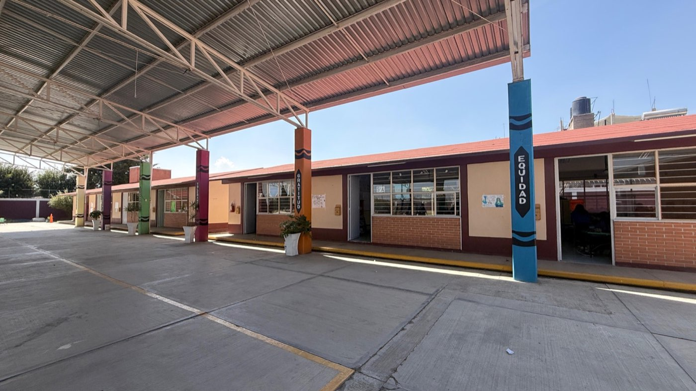

# Esc. Prim. "Miguel Hidalgo" — Sitio Web Institucional

Sitio web estático de la Escuela Primaria "Miguel Hidalgo", C.C.T. 15DPR0560I, Los Reyes San Salvador, Texcoco, Estado de México. Publicado vía GitHub Pages.

**URL en producción:** https://esc-miguel-hidalgo.github.io  
**Repositorio:** https://github.com/esc-miguel-hidalgo/esc-miguel-hidalgo.github.io

---

## Stack

| Capa | Decisión |
|---|---|
| HTML | Semántico, un solo archivo por página (`index.html`, `huerto.html`) |
| CSS | Inline `<style>` en cada página, design tokens vía CSS custom properties |
| JS | Vanilla JS inline `<script>`, sin dependencias ni bundler |
| Fuentes | Google Fonts: **Baloo 2** (display/headings) + **DM Sans** (body) |
| Hosting | GitHub Pages — rama `main`, despliegue automático en cada push |

Sin framework, sin build step, sin node_modules. Cualquier editor de texto + git es suficiente para trabajar.

---

## Estructura de archivos

```
/
├── index.html              # Página principal (landing completa)
├── huerto.html             # Subpágina del proyecto Huerto Escolar
├── escudo.png              # Logo institucional (usado en nav + OG image)
├── favicon.ico
├── favicon-32x32.png
├── apple-touch-icon.png
└── media/
    ├── panoramica.jpg          # Foto panorámica hero (index.html)
    ├── Instalaciones/          # Carrusel de fotos del plantel (12 fotos)
    │   ├── foto1.jpg  → Aulas
    │   ├── foto2.jpg  → Comedor escolar
    │   ├── foto3.jpg  → Patio cívico
    │   ├── foto4.jpg  → Canchas deportivas
    │   ├── foto5.jpg  → Biblioteca escolar
    │   ├── foto6.jpg  → Sanitarios
    │   ├── foto7.jpg  → Huerto escolar
    │   ├── foto8.jpg  → Huerto escolar
    │   ├── foto9.jpg  → Desayunos calientes
    │   ├── foto10.jpg → Plato del Bien Comer
    │   ├── foto11.jpg → Comedor
    │   └── foto12.jpg → Aula de cómputo
    ├── huerto/                 # Galería de la página huerto.html (7 fotos)
    │   ├── foto1.jpg … foto7.jpg
    └── Inscripciones-2026-2027/  # Inscripción y útiles escolares ciclo 2026–2027 (#inscripcion, #utiles)
        ├── requisitos-inscripcion.jpg      # Hoja de requisitos (fecha, documentos, expedientes, boletas)
        ├── informacion-adicional.jpg       # Aportación voluntaria y credencial
        ├── utiles-1A.jpg … utiles-6A.jpg   # Lista de útiles por grado/grupo (7 imágenes)
        └── listado-utiles-escolares-2026-2027.pdf  # PDF completo con las 7 listas
```

> **Nota:** El repositorio remoto contiene además una carpeta `img/` con fotos legadas que no se usan en la versión actual del sitio.

---

## Design System

### Tokens (CSS custom properties)

Definidos en `:root` al inicio del `<style>` de cada página.

#### Paleta principal (`index.html`)

| Token | Hex | Uso |
|---|---|---|
| `--navy` | `#1B2A4A` | Fondo hero, nav, headings |
| `--navy-deep` | `#111C33` | Top bar, footer |
| `--navy-mid` | `#243656` | Hover states nav |
| `--amber` | `#E8A838` | CTA primario, acento, cursor |
| `--amber-soft` | `#F5C563` | Hover de amber |
| `--rust` | `#C0392B` | Badge, alertas, cursor hover |
| `--terracotta` | `#D4654A` | Gradientes cálidos |
| `--sage` | `#5A8A6A` | Pills de valores (tercer color) |
| `--sand` | `#FAF3E8` | Fondo secciones claras |
| `--cream` | `#FFFDF8` | Fondo base del body |

#### Sombras

| Token | Uso recomendado |
|---|---|
| `--sh-xs` | Bordes sutiles, inputs |
| `--sh-sm` | Cards en reposo |
| `--sh-md` | Modales, dropdowns |
| `--sh-lg` | Cards en hover |
| `--sh-xl` | Elementos flotantes prominentes |

#### Border radius

| Token | Valor | Uso |
|---|---|---|
| `--r` | `20px` | Cards grandes, secciones |
| `--r-sm` | `14px` | Cards pequeñas, pills |
| `--r-xs` | `10px` | Badges, tags |

### Tipografía

```css
/* Headings — todos los h1-h5 */
font-family: 'Baloo 2', cursive;
font-weight: 800 (h1/h2), 700 (h3/h4)

/* Body */
font-family: 'DM Sans', sans-serif;
font-weight: 400 / 500 / 600
line-height: 1.7
```

Tamaños de heading con `clamp()` para fluidez responsive:
```css
h2: clamp(1.7rem, 3.5vw, 2.4rem)
h1: clamp(1.7rem, 4.5vw, 3rem)
```

### Iconos SVG

Sistema de clases para iconos Lucide-style (`fill:none`, `stroke:currentColor`):

```html
<svg class="ic-svg" viewBox="0 0 24 24" aria-hidden="true">...</svg>    <!-- 22px, general -->
<svg class="ic-svg-lg" viewBox="0 0 24 24" aria-hidden="true">...</svg>  <!-- 28px, destacado -->
<svg class="ic-svg-sm" viewBox="0 0 24 24" aria-hidden="true">...</svg>  <!-- 17px, inline -->
```

Siempre `aria-hidden="true"` en íconos decorativos. Si el ícono transmite información sin texto adyacente, usar `aria-label` en su lugar.

---

## Arquitectura de componentes

### Scroll reveal (`.rv` / `.rv-scale`)

```html
<div class="rv">Aparece deslizando hacia arriba</div>
<div class="rv-scale">Aparece escalando desde 85%</div>
```

El JS al fondo del `<script>` registra un `IntersectionObserver` que añade `.vis` cuando el elemento entra al viewport. Umbral: `0.1`, margen: `-50px` en el bottom.

Para controlar el orden de aparición dentro de un grupo:
```html
<div class="rv" style="transition-delay:0ms">Primero</div>
<div class="rv" style="transition-delay:150ms">Segundo</div>
<div class="rv" style="transition-delay:300ms">Tercero</div>
```

### Carrusel full-width (`fw-carousel`)

Hay dos instancias: `#carEvents` (eventos) y `#carInst` (instalaciones). Ambos se inicializan con `initC(id, dotsContainerId)`, dentro de una `.fw-carousel-section` (pausa el auto-advance en hover):

```html
<div class="fw-carousel" id="carInst">        <!-- translateX mueve las slides -->
  <div class="fw-slide fw-slide-photo">
    
    <div class="fw-slide-info">                <!-- caption opcional -->
      <h4>Título de la foto</h4>
    </div>
  </div>
  <!-- más slides... -->
</div>
<div class="fw-dots" id="dotsInst"></div>       <!-- dots generados por JS -->
<!-- botones prev/next opcionales con class="fw-btn" -->
```

Los slides de foto usan `` real (no `background-image`) para que el navegador difiera la carga y para que el `alt` sea accesible a lectores de pantalla. Los slides de video (`#carEvents`) usan una "facade" — botón `.yt-facade` con la miniatura de YouTube que sólo carga el iframe real al hacer clic (ver `CONTRIBUTING.md` → "Agregar un evento al carrusel de eventos").

- Auto-advance cada **6 segundos**; se pausa al hacer hover sobre `.fw-carousel-section`
- Soporta swipe en touch (umbral: 50px)
- Los dots se generan dinámicamente; no escribirlos en el HTML

### Cursor personalizado

**Sólo en dispositivos con hover** (`@media(hover:none)` lo desactiva en touch) y **sólo si el usuario no pidió menos movimiento** (`@media(prefers-reduced-motion:reduce)` también lo desactiva). Es una capa decorativa *adicional* — el cursor nativo del sistema sigue visible en todo momento (`cursor:auto` en `body`), así que no interfiere con ajustes de accesibilidad del SO (tamaño/color de cursor).

Estructura:
```html
<body>
  <div id="cDot" class="c-dot" aria-hidden="true"></div>
  <!-- Las partículas se crean en JS (pool de 12 divs .c-particle) -->
```

**Cómo funciona:**
- `.c-dot` sigue el mouse sin lag (posición calculada directamente en `mousemove`)
- 12 partículas pre-creadas en un pool (flag `free`), sin crear/destruir DOM
- Cada partícula se emite máx. cada 85ms usando `performance.now()`
- Animación `cPop` usa CSS custom properties `--ex`/`--ey` para posición inicial
- `body.c-hov` se activa con `mouseover` en elementos interactivos (`a`, `button`, cards) → el dot crece y cambia de color

Para agregar un elemento nuevo a la detección de hover, añadirlo al selector en el JS:
```js
e.target.closest('a,button,.mi-nuevo-componente')
```

**En `huerto.html`:** misma arquitectura, colores verdes (`var(--leaf)` + `var(--sun)`).

### Sección de inscripción (`#inscripcion`)

Estructura fija de tres zonas:
1. `.enroll-steps` — grid 3 columnas con flechas `›` entre pasos
2. `.doc-grid` — grid 2 columnas: "Documentos (copias)" y "Se recogen en dirección"
3. `.enroll-actions` — botones tel + mailto

Para modificar los pasos o documentos, editar directamente el HTML en las líneas marcadas con `<!-- ═══ INSCRIPCIÓN ═══ -->`.

---

## Secciones de `index.html`

| ID | Clase CSS | Contenido |
|---|---|---|
| *(hero)* | `.hero` | H1, badge ciclo, estadísticas, CTA → `#inscripcion` |
| *(panorámica)* | `.panoramic-section` | `media/panoramica.jpg` |
| *(drone video)* | `.drone-section` | iframe YouTube embebido |
| `#nosotros` | `.sec-sand` | Cards de identidad (Misión, Visión, Valores, Compromiso) + pills de valores |
| `#maestros` | `.sec-sand` | Cards del personal docente |
| `#eventos` | `.sec-dark fw-carousel-section` | Carrusel de eventos (`#carEvents`) |
| `#instalaciones` | `.sec-sand` | Texto introductorio de infraestructura |
| `#fotos-inst` | `.sec-sand fw-carousel-section` | Carrusel de fotos (`#carInst`, 12 slides) |
| `#servicios` | `.sec-sand` | Cards de servicios (Horario extendido, Comedor, Cómputo, Inglés) |
| `#inscripcion` | `.sec-sand` | Proceso de inscripción + fecha/documentos del ciclo 2026–2027 + expedientes + boletas por grado + aportación/credencial + CTAs |
| `#utiles` | `.sec-sand` | Listas de útiles escolares por grado/grupo (tabs), texto + imagen descargable + PDF completo |
| `#horarios` | `.sec-sand` | Datos generales + horario escolar |
| `#contacto` | `.sec-sand` | Cards de contacto + iframe Google Maps |
| *(footer)* | `.footer` | Nav rápida + créditos |

---

## Decisiones técnicas relevantes

### Por qué no hay framework
El sitio lo mantiene personal de la escuela sin perfil técnico. Un único archivo HTML editable en cualquier editor es más sostenible que un proyecto con dependencias de npm.

### Por qué no hay canvas en el cursor
La versión anterior usaba `<canvas>` con un `requestAnimationFrame` que corría **sin parar** aunque el mouse no se moviera, quemando CPU innecesariamente. La versión actual usa un pool de 12 divs pre-creados y el rAF sólo corre cuando hay movimiento real.

### Por qué CSS `rotate` en el ring (referencia histórica)
El anillo rotante fue eliminado por ser visualmente distractor. Si se quiere restaurar algún día: la propiedad CSS `rotate` (no `transform: rotate()`) compone aditivamente con `transform`, permitiendo que el JS setee posición vía `transform` mientras CSS anima la rotación — sin conflicto.

### Contraste WCAG
Textos sobre fondos oscuros usan opacidad mínima de `.75` (no `.55` que estaba antes). Colores de texto secundario sobre fondo blanco: mínimo `#666` (no `#999`).

### Emojis decorativos
Todos los emojis que son decorativos llevan `aria-hidden="true"` en un `<span>` envolvente. Los que aportan semántica real (si existieran) deben llevar `role="img"` y `aria-label`.

---

## Entorno local

No hay servidor de desarrollo requerido. Abrir `index.html` directo en el navegador funciona para la mayoría del contenido. Para los iframes de YouTube y Google Maps se necesita conexión a internet.

Si se quiere un servidor local simple:
```bash
cd /ruta/al/proyecto
python3 -m http.server 8080
# abrir http://localhost:8080
```

---

## Git y despliegue

### Configuración SSH (ya aplicada)

```
~/.ssh/github_escuela      # llave privada Ed25519
~/.ssh/github_escuela.pub  # llave pública (registrada en GitHub bajo la cuenta esc-miguel-hidalgo)
~/.ssh/config              # mapea el alias "github-escuela" → github.com con esa llave
```

El remote del proyecto está configurado con el alias SSH:
```
origin → git@github-escuela:esc-miguel-hidalgo/esc-miguel-hidalgo.github.io.git
```

### Flujo de trabajo

```bash
# 1. Editar index.html y/o huerto.html
# 2. Verificar cambios
git diff index.html

# 3. Staging y commit
git add index.html huerto.html
git commit -m "descripción del cambio"

# 4. Push — despliega automáticamente en GitHub Pages (1-2 min)
git push
```

**No usar** `git add .` ni `git add -A` para evitar subir `.DS_Store` u otros archivos del sistema.

### Agregar archivos de media

```bash
git add media/Instalaciones/foto13.jpg
git commit -m "agrega foto13 al carrusel de instalaciones"
git push
```

---

## Pendientes / roadmap

| Prioridad | Tarea |
|---|---|
| Media | Formulario de contacto online (reemplazar los CTAs de tel/email) |
| Media | Sección de preguntas frecuentes (FAQ) |
| Media | Links a redes sociales en footer |
| Baja | Reemplazar emojis en cards de identidad (`#nosotros`) con SVGs |
| Baja | Reemplazar emojis en cards de maestros con fotos reales |
| Baja | Alt texts descriptivos en galería de `huerto.html` (actualmente genéricos) |
| Baja | Captions de fotos en carrusel de eventos (`#carEvents`) |

---

## Créditos

- Escuela Primaria "Miguel Hidalgo" · C.C.T. 15DPR0560I · Zona 55 · Sector III
- Ciclo Escolar 2026–2027
